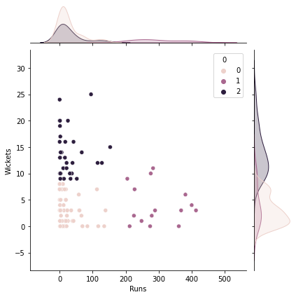
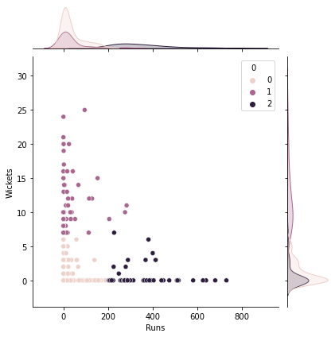

# Grouping IPL Cricketers -  Clustering
- In this project, I use data from the IPL 2023 to perform a k-means clustering algorithm that will split players into different categories depending on stats like the number of wickets they took and the number of runs they scored.
- The data used in this project comes from [Kaggle](https://www.kaggle.com/datasets/purnend26/ipl-2023-dataset).
- In particular, I was interested in determining which players had performed well with the ball and which had performed well with the bat in the IPL 2023. To do this required a lot of data manipulation, including concatenation of the bowling and batting datasets using an inner join.
- Using sklearn’s KMeans clustering algorithm, I clustered the players into three groups according to runs scored and wickets taken. Roughly the three groups were players who scored more than 200 runs, players with more than eight wickets and players with less than eight wickets and less than 200 runs. From this, someone can work out using the data frame which players did well with the bat and which players did well with the ball in particular. Using Seaborn, I could then visualise the results.

- Next, I did the same but for the outer joint.
- For this example, the groups are roughly players who scored more than 200 runs, players with more than six wickets and players with less than six wickets and less than 200 runs. 

- This is a good visualization showing some insights of the IPL 2023.
- There are plenty more things that I could do with this dataset. Including working out which players had the most impact in the tournament.
- If there are similar datasets from previous years, then I could use these to see how players have performed across multiple IPLs.
- Sports trading companies can use these sorts of projects to help inform their trades for different tournaments.
